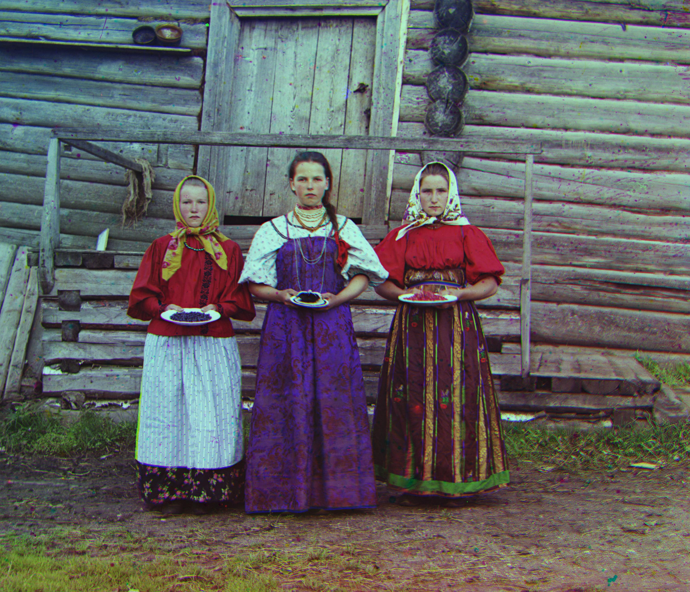

# Prokudin-Gorskii colorization

By Klas Eskilson for the Image processing and analysis course at Linköping University.

This is a simple Matlab program used to align, crop and color correct photos from the [Prokudin-Gorskii Collection](http://www.loc.gov/pictures/collection/prok/). See [lab4.m](lab4.m) for how to use the functions.

Also, see [documentation/report.pdf](documentation/report.pdf) for a short report that describes the used methods.
